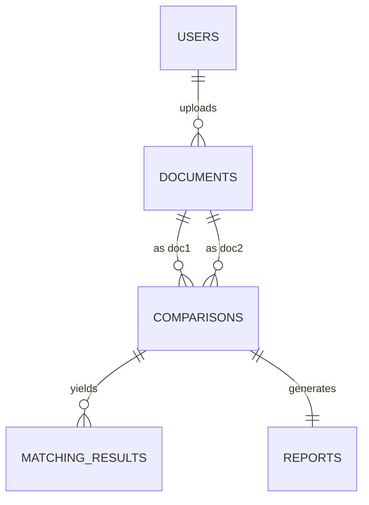

# Plagiarism & Duplicate Text Detector

A college-grade, modular **Plagiarism and Duplicate Text Detection System** built using **Python 3**, **Data Structures & Algorithms (Rabin-Karp Rolling Hash & KMP Pattern Matching)**, and a **MySQL Relational Database**.

---

## Table of Contents
1. [Project Objective](#1-project-objective)
2. [Key Features](#2-key-features)
3. [Technology Stack](#3-technology-stack)
4. [Data Structures & Algorithms (DSA)](#4-data-structures--algorithms-dsa)
5. [Database Architecture & Schema](#5-database-architecture--schema)
6. [ER Diagram](#6-er-diagram)
7. [Project Directory Layout](#7-project-directory-layout)
8. [Installation & Setup Guide](#8-installation--setup-guide)
9. [How to Run the Application](#9-how-to-run-the-application)
10. [Sample Output & Screenshots](#10-sample-output--screenshots)

---

## 1. Project Objective
Educational institutions often require a transparent, algorithm-driven tool to verify the uniqueness of submitted assignments and detect duplicate word sequences across student submissions.

This project implements a **Rabin-Karp Rolling Hash Engine** with **KMP (Knuth-Morris-Pratt)** phrase verification. It tokenizes raw document text, computes windowed polynomial rolling hashes, detects overlapping sequence matches, calculates a similarity percentage, classifies risk levels into **LOW**, **MEDIUM**, or **HIGH**, and persists all records, user info, and detailed reports into a **MySQL database**.

---

## 2. Key Features

- **User Management**: Register users, view registered users, search users by email/name.
- **Document Management**: Upload `.txt` files, extract raw text, compute word count, store timestamps, search stored documents.
- **Pairwise Comparison (Doc A vs Doc B)**: Compare any 2 documents using Rabin-Karp word-window rolling hashes & KMP phrase verification.
- **One-to-Many Comparison (Doc A vs All)**: Compare one target document against all uploaded database documents and rank by similarity score.
- **Matched Sequence Extraction**: Displays exact matching word phrases, word positions in Doc 1 and Doc 2, word sequence length, and longest matched section.
- **Plagiarism Report File Generation**: Exports a formatted `.txt` report containing detailed match metrics and phrase positions.
- **Advanced SQL Analytics**: Features multi-table `JOIN`, `GROUP BY + HAVING` queries, `SUBQUERY` filters, and `COUNT`/`AVG`/`MAX`/`MIN` aggregation statistics.

---

## 3. Technology Stack

- **Language**: Python 3.10+
- **Database**: MySQL Server 8.0+
- **DB Driver**: `mysql-connector-python`
- **Config Management**: `python-dotenv`
- **Architecture**: Modular Service-Oriented Command-Line Interface (CLI)

---

## 4. Data Structures & Algorithms (DSA)

| DSA Concept | Implementation File | Usage & Purpose |
| :--- | :--- | :--- |
| **Arrays / Lists** | `utils/text_cleaner.py` | Stores tokenized words allowing $O(1)$ index access for window creation. |
| **Hash Tables / Dictionaries** | `algorithms/rabin_karp.py` | Maps computed window hashes to list of phrases for $O(1)$ average time lookup. |
| **Sets** | `algorithms/similarity.py` | Tracks unique matched word indices in Document 1 to eliminate double-counting overlapping windows. |
| **Rabin-Karp (Rolling Hash)** | `algorithms/rabin_karp.py` | Calculates initial polynomial hash in $O(k)$ time and updates sliding window in $O(1)$ constant time. |
| **KMP Algorithm (LPS Array)** | `algorithms/kmp.py` | Uses Longest Prefix Suffix (LPS) array for $O(N + M)$ phrase verification without character backtracking. |

---

## 5. Database Architecture & Schema

Database Name: `plagiarism_detector`

1. **`users`**: `user_id` (PK, AUTO_INCREMENT), `name`, `email` (UNIQUE), `created_at`
2. **`documents`**: `document_id` (PK, AUTO_INCREMENT), `user_id` (FK -> users.user_id ON DELETE CASCADE), `file_name`, `content` (LONGTEXT), `word_count`, `uploaded_at`
3. **`comparisons`**: `comparison_id` (PK, AUTO_INCREMENT), `document1_id` (FK), `document2_id` (FK), `similarity_score` (DECIMAL(5,2)), `status` (VARCHAR(20)), `compared_at`
4. **`matching_results`**: `match_id` (PK, AUTO_INCREMENT), `comparison_id` (FK -> comparisons.comparison_id ON DELETE CASCADE), `phrase`, `position_doc1`, `position_doc2`, `match_length`
5. **`reports`**: `report_id` (PK, AUTO_INCREMENT), `comparison_id` (FK, UNIQUE), `total_matches`, `longest_match`, `generated_at`

---

## 6. ER Diagram

```
[ USERS ] 1 ──── N [ DOCUMENTS ]
                         │
                         ├── 1 ──── N [ COMPARISONS (Doc 1) ]
                         └── 1 ──── N [ COMPARISONS (Doc 2) ]
                                            │
                                            ├── 1 ──── N [ MATCHING_RESULTS ]
                                            └── 1 ──── 1 [ REPORTS ]
```



---

## 7. Project Directory Layout

```
anpd_project/
├── main.py                     # Main CLI Menu & Entry Point
├── test_suite.py               # Standalone Algorithmic Test Suite
├── requirements.txt            # Python Dependencies
├── .env.example                # MySQL Configuration Template
├── README.md                   # Project Documentation & Viva Voce Guide
│
├── sql/
│   └── database.sql            # Full SQL DDL & Seed Data
│
├── database/
│   ├── __init__.py
│   ├── connection.py           # MySQL Connection Pool & Error Handling
│   └── queries.py              # Parameterized SQL Queries & Analytics
│
├── algorithms/
│   ├── __init__.py
│   ├── rabin_karp.py           # Manual Rabin-Karp Rolling Hash Engine
│   ├── kmp.py                  # Manual KMP Pattern Matcher & LPS Array
│   └── similarity.py           # Similarity % & Risk Classification
│
├── services/
│   ├── __init__.py
│   ├── document_service.py     # Document Upload & User Services
│   └── comparison_service.py   # Comparison & Report Services
│
├── utils/
│   ├── __init__.py
│   └── text_cleaner.py         # Text Preprocessing & Tokenizer
│
├── documents/                  # Sample Test Documents
│   ├── sample1.txt
│   ├── sample2.txt
│   ├── sample3.txt
│   ├── empty.txt
│   └── single_word.txt
│
└── reports/                    # Output Generated Text Reports
```

---

## 8. Installation & Setup Guide

### Step 1: Prerequisites
Ensure Python 3.10+ and MySQL Server are installed on your machine.

### Step 2: Clone / Open Project
Navigate to the project root directory:
```bash
cd c:\Users\Daksh Prajapati\Desktop\anpd_project
```

### Step 3: Install Dependencies
```bash
pip install -r requirements.txt
```

### Step 4: Setup MySQL Database
Import the SQL database script into MySQL.

**In Windows PowerShell:**
```powershell
Get-Content sql\database.sql | mysql -u root -p
```
*Or using CMD / Command Prompt:*
```cmd
mysql -u root -p < sql\database.sql
```

### Step 5: Configure Environment Credentials
Copy `.env.example` to `.env` (or configure `database/connection.py`) with your MySQL password:
```env
DB_HOST=localhost
DB_PORT=3306
DB_USER=root
DB_PASSWORD=your_actual_mysql_password
DB_NAME=plagiarism_detector
```

---

## 9. How to Run the Application

### A. Run Standalone Test Suite (No MySQL DB Required)
To verify algorithm correctness (Rabin-Karp, KMP, Text Preprocessor, Similarity Engine):
```bash
python test_suite.py
```

### B. Run Main Interactive CLI Application
To launch the full system interactive menu:
```bash
python main.py
```

---

## 10. Sample Output

```
======================================================================
                       PLAGIARISM DETECTION REPORT                   
======================================================================
Report ID / Comparison ID : #1
Generated Date           : 2026-09-09 21:28:00
Document 1 (Target)      : assignment_01.txt (Owner: Alice Smith)
Document 2 (Compared With): assignment_02.txt (Owner: Bob Johnson)
----------------------------------------------------------------------
SIMILARITY SCORE         : 64.71%
RISK ASSESSMENT LEVEL    : HIGH
Total Matched Sections   : 1
Longest Sequence Match   : 8 words
======================================================================

## DETAILED MATCHING SECTIONS / PHRASES:

  Match #1:
    Phrase        : "machine learning is a subset of artificial intelligence"
    Doc 1 Position: Word index 0
    Doc 2 Position: Word index 0
    Word Length   : 8 words
======================================================================
```
